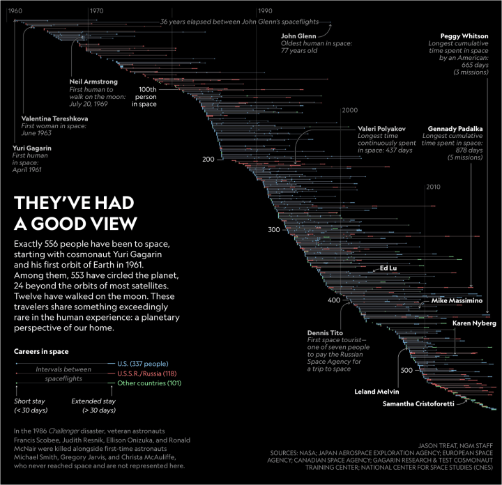
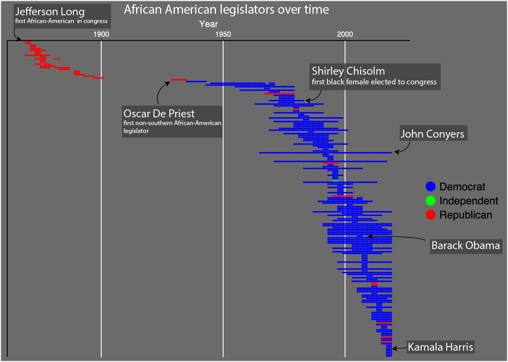

# African_American_Congress_Senators
Plots of African American Legislators over time, a chance to experiment with web scraping and data visualization.

These data come from a list maintained by the United States House of Reps [Data](https://history.house.gov/Exhibitions-and-Publications/BAIC/Historical-Data/Black-American-Representatives-and-Senators-by-Congress/)

I was initially trying to replicate this image of astronauts through time:

My result with ggplot and a little bit of illustrator looked like this:

More discussion and analysis at my [blog](https://matthewmorriss.weebly.com/codeblog/african-american-legislators-throughtime)
